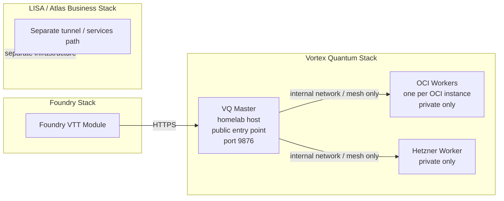

# RNK System Optimizer — Vortex Quantum Deployment Topology

This note documents the recommended separation for the Foundry-facing Vortex Quantum stack.

## Topology

## Recommended rules

- Expose only the VQ master to Foundry.
- Keep the master on the homelab server.
- Keep workers private on the internal network or private overlay.
- Place one worker on each OCI instance and one worker on Hetzner for the current deployment split.
- Keep the LISA / Atlas business stack on its own ingress and service namespace.
- If workers ever need cross-host reachability, use a private mesh or VPN instead of public tunnels.

## Why this layout

- It keeps the Foundry stack separate from the business stack.
- It reduces the public attack surface to one service: the VQ master.
- It makes worker restarts and reshaping safer because the module only depends on the master endpoint.
- It keeps the homelab host as the stable browser-facing control point while OCI and Hetzner provide distributed worker capacity.

## Related docs

- `docs/vq-deployment-runbook.md`
- `docs/current-system-setup.md`
- `SERVICES_MANIFEST.md`
- `README.md`
